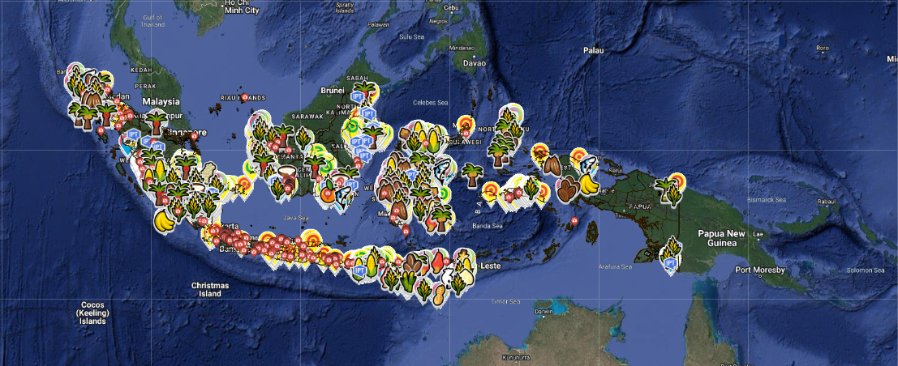

# Sistem Informasi Peta Terpadu Kawasan Transmigrasi

    
&nbsp;&nbsp;&nbsp;&nbsp;&nbsp;&nbsp;&nbsp;&nbsp;&nbsp;&nbsp;&nbsp;&nbsp;&nbsp;&nbsp;&nbsp;&nbsp;&nbsp;&nbsp;Repository ini berisi engine untuk scrapping data Sistem Informasai Peta Terpadu Kawasan Transmigrasi atau biasa di kenal dengan SIPUKAT dengan metode requests API menggunakan python dan di rapihkan dengan BeautifulSoup 4.

## Environment
```
# Create Environment
$ python -m venv env

# Activate Environment
$ source env/bin/activate

# Install Requirement 
$ pip install -r requirements.txt
```

## How to use engine
### Controller
- Controller berisi semua engine worker yang dibedakan foldernya berdasarkan source atau website yang di crawling. 

### Lib (library)
-  Library berisi package yang diperlukan seperti BeautifulSoup 4 dan Storage Manager untuk simpan json ke local atau pun S3.

### Test
- Folder test berisi file file untuk testing api ataupun testing script dan engine lainnya sebelum masuk ke controller

## How to running engine
```
$ python main.py -n [NAMA_CLASS] -f [PATH_FILE_LATLONG]
```

## How to get Latlong data file
Untuk mendapatkan file data latlong bisa menghampiri meja RD.Galih Rakasiwi (Scrapper Enginer) atau hubungi melalui telegram @radengalih